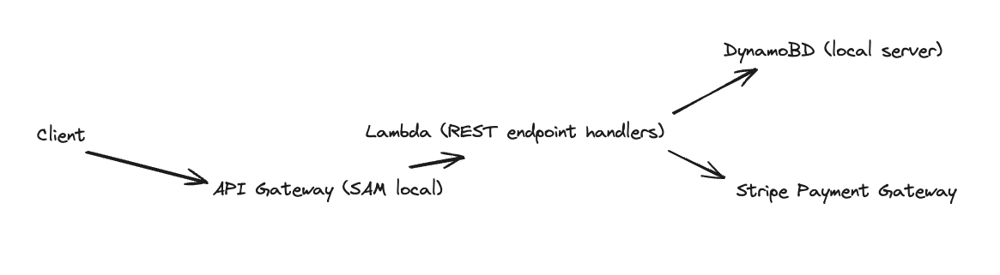
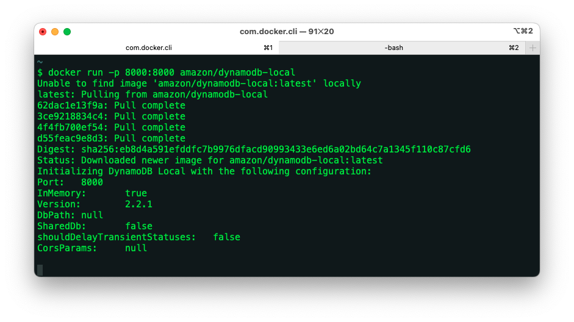
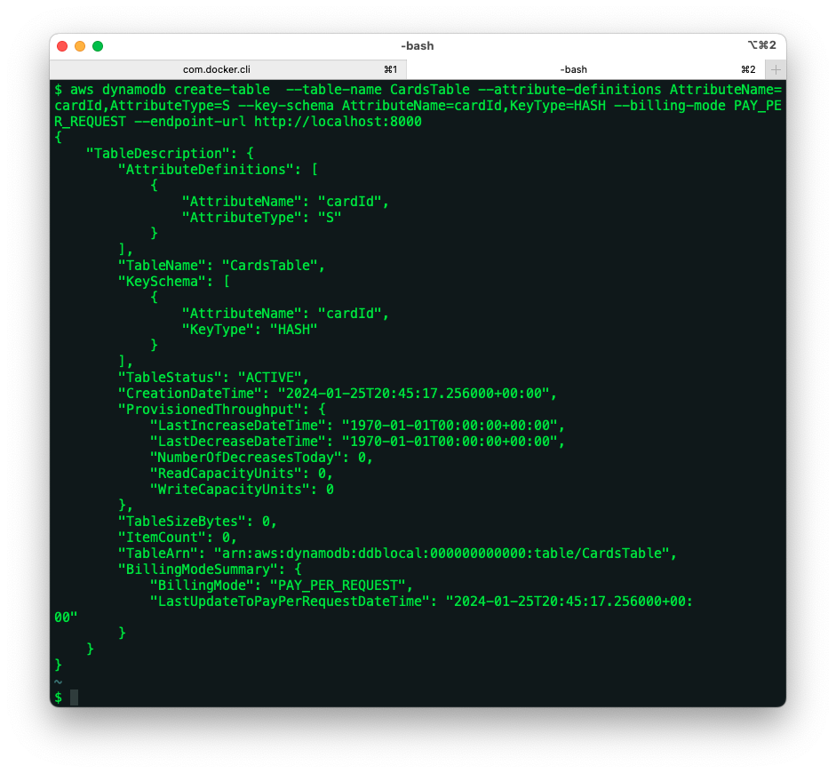
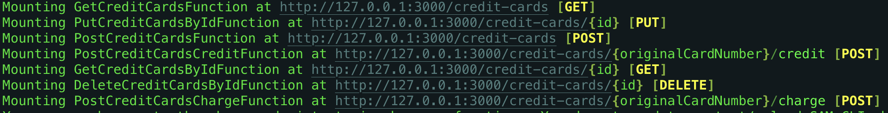

# cc-app (CreditCard-app)



This project contains source code and supporting files for a serverless application that you can run locally with the SAM CLI. It includes the following files and folders.

- src - Code for the application's Lambda function written in TypeScript.
- events - Invocation events that you can use to invoke the APIs (or just use aliases provided)
- src/tests - Unit tests for the application code.
- template.yaml - A template that defines the application's AWS resources.

The application uses several AWS resources, including Lambda functions and an API Gateway API. These resources are defined in the `template.yaml` file in this project. However, NO DEPLOY NEEDED! All resources are locally executable using steps below.

## Running the application locally

The Serverless Application Model Command Line Interface (SAM CLI) is an extension of the AWS CLI that adds functionality for building and testing Lambda applications. It uses Docker to run your functions in an Amazon Linux environment that matches Lambda. It can also emulate your application's build environment and API.

To use the SAM CLI, you need the following tools.

- SAM CLI - [Install the SAM CLI](https://docs.aws.amazon.com/serverless-application-model/latest/developerguide/serverless-sam-cli-install.html)
- Node.js - [Install Node.js 16](https://nodejs.org/en/), including the NPM package management tool.
- Docker - [Install Docker community edition](https://hub.docker.com/search/?type=edition&offering=community)

To use dynamoDB Local, you will need to start the database server using docker:

```bash
$ docker run -p 8000:8000 amazon/dynamodb-local
```



> Note: Restarting the server will require the table resources to be rebuilt as instructed below

Then, in another terminal, you will need to use the AWS CLI to build the table similar to the one found in the `template.yaml`. This is only because we will be running the application locally, otherwise, CloudFormation would provision the table specified in the `template.yaml` as part of the deployment.

```bash
$ aws dynamodb create-table  --table-name CardsTable --attribute-definitions AttributeName=cardId,AttributeType=S --key-schema AttributeName=cardId,KeyType=HASH --billing-mode PAY_PER_REQUEST --endpoint-url http://localhost:8000
```



Finally, to build your application, run the following in your shell from the repository's root. The SAM CLI can emulate your application's API. The second command below `sam local start-api` will run the API locally on port 3000.:

```bash
cc-app$ sam build && sam local start-api --env-vars env.json
```



## Using the application

The following commands can be used to test the application in a terminal:

Create an VISA account for Paddy with a credit limit of €1000.

```bash
$ curl -d '{"name":"Paddy", "cardType":"Visa", "cardLimit":"1000"}' -H "Content-Type: application/json" -X POST http://localhost:3000/credit-cards
```

> Note: Try using the home address explicitly (i.e. http://127.0.0.1:3000/credit-cards) if there is no reply from localhost

Fetch the newly created account by using the _cardId_ returned from the previous request as the {id} path parameter here:

```bash
$ curl http://localhost:3000/credit-cards/{id}
```

Paddy has been in the pub all night and needs an update to his credit limit to keep the pints going. Once again, use the _cardId_ as the {id}

```bash
$ curl -d '{"cardLimit":"2000"}' -H "Content-Type: application/json" -X POST http://localhost:3000/credit-cards/{id}
```

Paddy has been charged a tenner on his way home for a spice bag. This time use the _originalCardNumber_ as the path parameter

```bash
$ curl -d '{"amount":"10"}' -H "Content-Type: application/json" -X POST http://localhost:3000/credit-cards/{originalCardNumber}/charge
```

The chips weren't great so a refund is in order. Use the _originalCardNumber_ again as the path parameter to credit the account.

```bash
$ curl -d '{"amount":"10"}' -H "Content-Type: application/json" -X POST http://localhost:3000/credit-cards/{originalCardNumber}/credit
```

The bank is not happy with Paddy's spending and has decided to delete his account. Use the _cardId_ as the {id} path parameter to soft delete the account (marks it with a _deleted_ flag so its no longer included in responses but can be re-activated if needed).

```bash
$ curl -X DELETE http://localhost:3000/credit-cards/{id}
```

Verify that the account has been deleted by requesting ALL active accounts using this GET request:

```bash
$ curl http://localhost:3000/credit-cards
```

## Unit tests

Tests are defined in the `src/tests` folder in this project. Use NPM to install the [Jest test framework](https://jestjs.io/) and run unit tests.

```bash
cc-app$ cd src
src$ npm install
src$ npm run test
```
